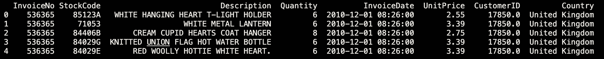
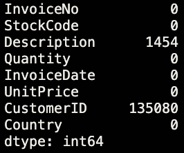
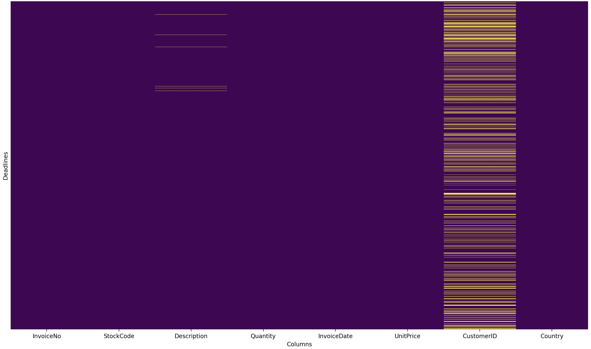
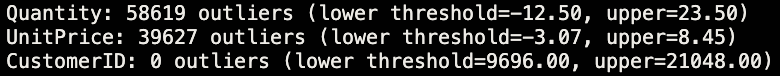

# Transactional Data Processing & Validation Pipeline

## This project implements a Python-based ETL pipeline for processing large transactional sales data. It extracts, transforms, validates, and loads data into a database, ensuring data quality and reproducibility for analytics and reporting.

### We will examine the Online Retail Dataset from Kaggle[Link: https://www.kaggle.com/datasets/ulrikthygepedersen/online-retail-dataset]


### Before creating the pipeline, an exploratory analysis of the dataset was conducted


### These are the first five rows of the dataset. You can see that the dataset contains columns such as: InvoiceNo, StockCode, Desription, Quantity, InvoiceDate, UnitPrice, CustomerID, Country



### This table shows the number of missing values: 1,454 for "Description" and 135,080 for "CustomerID".

### Missing values in the dataset (yellow = missing)



### We can also check for outliers in the dataset and see the following image:


--------

### After EDA, was generated the extract file — the first step in the pipeline, which is required to load the source CSV file.

### Next, a file named "validate.py" was created to analyze the data and check for compliance with certain requirements. Once we identify any missing values, errors, or other inconsistencies in our data, we can correct them in the transform.py" file.

### The validation checks revealed the following:
- Schema Check — all 8 required columns present
- Null Check — no nulls in critical columns (InvoiceNo, StockCode, Quantity, UnitPrice)
- 135,080 rows with no CustomerID (guest orders — expected, not a blocker)
- 10,624 rows with negative Quantity (returns & cancellations)
- 2,517 rows with zero or negative UnitPrice

---

### Transform — `transform.py`

After validation, the data was cleaned and enriched in `transform.py`. This is the core of the pipeline.

**Cleansing:**
- Separated 9,288 cancellation transactions (InvoiceNo starting with 'C') into a dedicated table
- Removed rows with negative Quantity, zero/negative UnitPrice, and missing CustomerID
- Dropped duplicates

### Result: 532,621 → 392,692 rows after cleansing

**Enrichment (new columns added):**

| Column | Description |
|---|---|
| `Revenue` | Quantity × UnitPrice |
| `Date`, `Year`, `Month`, `DayOfWeek`, `Hour` | Extracted from InvoiceDate |
| `CumulativeRevenue` | Running total per customer (window function) |
| `PurchaseRank` | Order number for each customer (window function) |
| `TotalCustomerRevenue` | Lifetime value per customer |
| `CustomerSegment` | Low / Mid / High based on total revenue |

**Aggregated tables:**
- `daily_sales` — revenue, orders, customers, items per day (305 days)
- `customer_summary` — RFM-like metrics per customer (4,338 customers)

---

### Load - `load.py`

Transformed DataFrames were loaded into a SQLite database (`data/sales.db`) using SQLAlchemy.

**4 tables created:**

| Table | Rows |
|---|---|
| `transactions` | 392,692 |
| `cancellations` | 9,288 |
| `daily_sales` | 305 |
| `customer_summary` | 4,338 |

**SQL analytics queries were run directly on the database:**

Cumulative revenue over time (window function):
```sql
SELECT
    Date,
    total_revenue,
    SUM(total_revenue) OVER (ORDER BY Date) AS cumulative_revenue
FROM daily_sales
ORDER BY Date
```

Top customers by revenue (window function):
```sql
SELECT
    CustomerID,
    total_revenue,
    RANK() OVER (ORDER BY total_revenue DESC) AS revenue_rank
FROM customer_summary
```

**Top 10 customers by revenue:**

| CustomerID | Revenue | Orders | Country |
|---|---|---|---|
| 14646 | £280,206 | 73 | Netherlands |
| 18102 | £259,657 | 60 | United Kingdom |
| 17450 | £194,390 | 46 | United Kingdom |

**Revenue by country (top 5):**

| Country | Revenue |
|---|---|
| United Kingdom | £7,285,024 |
| Netherlands | £285,446 |
| EIRE | £265,262 |
| Germany | £228,678 |
| France | £208,934 |

---

### Pipeline — `pipeline.py`

All steps are orchestrated in a single file. Run the entire pipeline with one command:
```bash
python src/pipeline.py
```

# Pipeline output:
### [STEP 1] Extracting data...     541,909 rows
### [STEP 2] Validating data...     3/3 checks passed
### [STEP 3] Transforming data...   392,692 rows clean
### [STEP 4] Loading to database... 4 tables
### [STEP 5] Running analytics